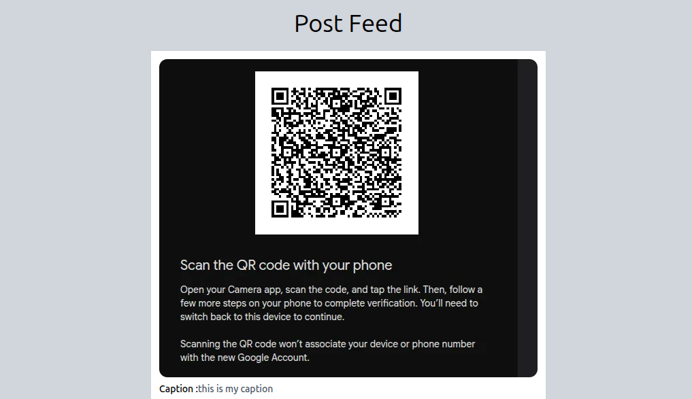
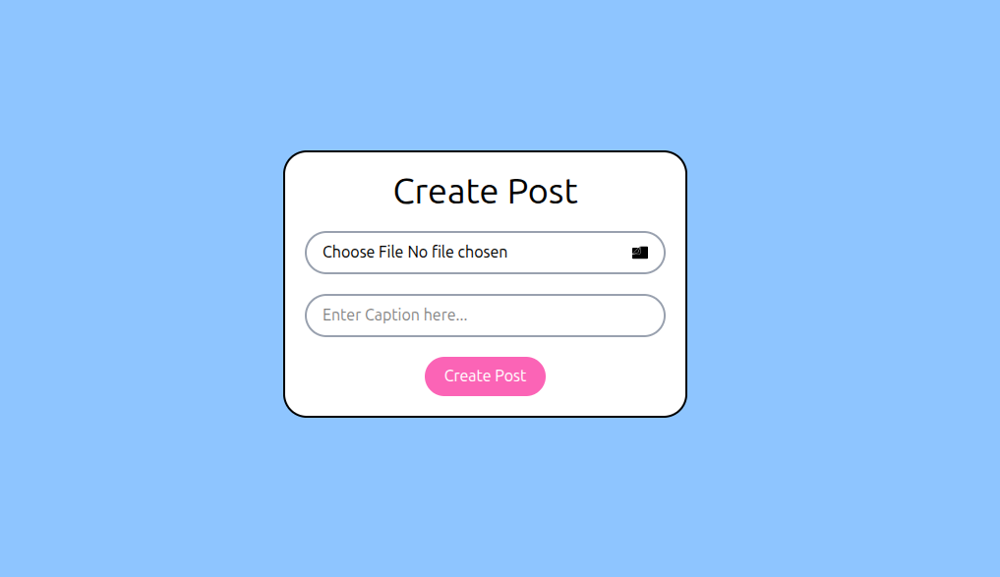

# 📝 Blog Application

A simple full-stack blog application built with **React**, **Express.js**, **MongoDB**, and **ImageKit**. Users can upload an image with a caption to create a blog post, and all posts are displayed on the Feed page.


---

## 📌 Features

- Create a new blog post
- Upload images using ImageKit
- Add captions to posts
- View all blog posts
- REST API with Express.js
- MongoDB integration using Mongoose
- Image upload using Multer
- Frontend and Backend communication using Axios

---

## 🛠️ Tech Stack

### Frontend
- React.js
- React Router DOM
- Axios
- React Icons
- CSS

### Backend
- Node.js
- Express.js
- MongoDB Atlas
- Mongoose
- Multer
- ImageKit SDK
- CORS
- dotenv

---

## 📂 Folder Structure

```text
class7
│
├── backend
│   ├── src
│   │   ├── db
│   │   │   └── db.js
│   │   ├── models
│   │   │   └── post.model.js
│   │   ├── services
│   │   │   └── storage.service.js
│   │   └── app.js
│   │
│   ├── .env
│   ├── package.json
│   └── server.js
│
└── frontend
    ├── pages
    │   ├── Feed.jsx
    │   └── CreatePost.jsx
    │
    ├── src
    │   ├── App.jsx
    │   ├── main.jsx
    │   └── index.css
    │
    ├── public
    └── package.json
```

---

## 🚀 Application Flow

```text
User

   │

   ▼

React Frontend

   │

Axios Request

   │

Express Server

   │

Multer Middleware

   │

ImageKit Upload

   │

MongoDB Atlas

   │

Response

   │

Feed Page
```

---

## 🌐 Frontend Routes

| Route | Description |
|--------|-------------|
| `/feed` | Display all blog posts |
| `/create-post` | Create a new blog post |

---

## 📡 Backend API

### Create Post

```http
POST /post-create
```

**Request**

FormData

```
image
caption
```

**Response**

```json
{
  "message": "Post Created.."
}
```

---

### Get All Posts

```http
GET /posts
```

**Response**

```json
{
  "message": "Data Fetched..",
  "posts": []
}
```

---

## 📦 Database Schema

```js
Post

{
    image: String,
    caption: String
}
```

---

## 📚 Concepts Covered

- Express.js
- React
- React Router DOM
- Axios
- MongoDB Atlas
- Mongoose
- Multer
- Image Upload
- ImageKit
- REST API
- Middleware
- CORS
- Environment Variables
- Async / Await
- FormData
- CRUD Fundamentals

---

## ⚙️ Installation

### Clone Repository

```bash
git clone <repository-url>
```

---

### Backend

```bash
cd backend

npm install

npm start
```

---

### Frontend

```bash
cd frontend

npm install

npm run dev
```

---

## 🔑 Environment Variables

Create a `.env` file inside the backend folder.

```env
MONGODB_URI=your_mongodb_connection_string

IMAGEKIT_PRIVATE_KEY=your_private_key
```

## 📷 Project Screenshots

### Feed Page



---

### Create Post Page



## 🎯 Learning Objectives

This project helped me learn:

- Building REST APIs with Express.js
- Connecting Express with MongoDB
- Creating Mongoose Models
- Uploading images using Multer
- Integrating ImageKit
- Sending FormData using Axios
- React Routing
- Fetching data from APIs
- Rendering dynamic data using React
- Full-stack communication between React and Express

---

## 👨‍💻 Author

**Suraj Kumar**

Frontend Developer & Computer Science Student
