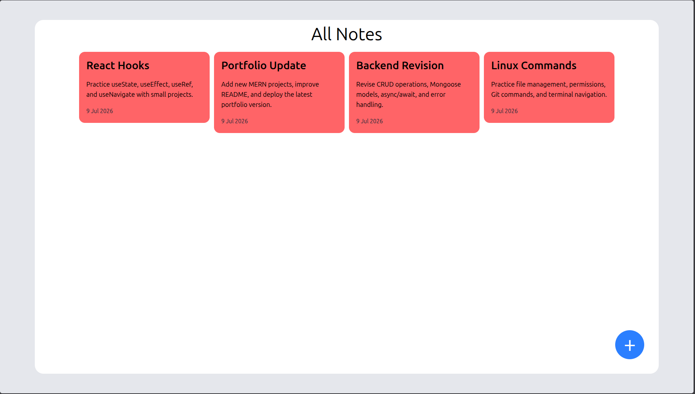
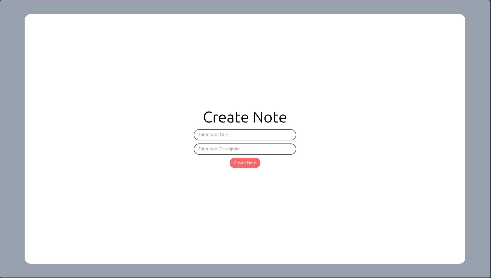

# 📝 Notes App

A simple and modern Notes App built with the MERN Stack. Users can create, view, and manage notes through a clean and responsive interface.

---

## 🚀 Features

- ✨ Create Notes
- 📋 View All Notes
- 🗑️ Delete Notes
- ✏️ Update Notes
- 🎨 Random Note Colors
- 📱 Responsive UI
- ⚡ Fast React + Vite Frontend
- 🌐 REST API with Express.js
- 🍃 MongoDB Database

---

## 🛠️ Tech Stack

### Frontend
- React.js
- Vite
- Tailwind CSS
- Axios
- React Router DOM

### Backend
- Node.js
- Express.js
- MongoDB
- Mongoose
- CORS
- dotenv

---

## 📂 Project Structure

```
class8/
│
├── frontend/
│   ├── src/
│   ├── public/
│   └── package.json
│
├── backend/
│   ├── src/
│   │   ├── models/
│   │   ├── routes/
│   │   ├── db/
│   │   └── app.js
│   ├── server.js
│   └── package.json
│
└── README.md
```

---

## ⚙️ Installation

### Clone Repository

```bash
git clone https://github.com/your-username/notes-app.git
```

---

### Backend Setup

```bash
cd backend
npm install
```

Create a `.env` file

```env
MONGO_URI=your_mongodb_connection_string
PORT=3000
```

Run Backend

```bash
npm run dev
```

---

### Frontend Setup

```bash
cd frontend
npm install
npm run dev
```

---

## 📡 API Endpoints

### Create Note

```
POST /create-note
```

### Get All Notes

```
GET /notes
```

### Update Note

```
PATCH /note/:id
```

### Delete Note

```
DELETE /note/:id
```

---

## 📸 Screenshots

### Feed Page



---

### Create Post Page




---

## 🌍 Deployment

Frontend: Vercel

Backend: Render

Database: MongoDB Atlas

---

## 📌 Future Improvements

- 🔍 Search Notes
- 📌 Pin Notes
- 📂 Archive Notes
- 🌙 Dark Mode
- 🔐 Authentication
- 🏷️ Categories
- 📅 Reminder Feature

---

## 👨‍💻 Author

**Suraj Kumar**

GitHub: https://github.com/imsurajyd

---

## ⭐ Support

If you like this project, don't forget to ⭐ the repository.
